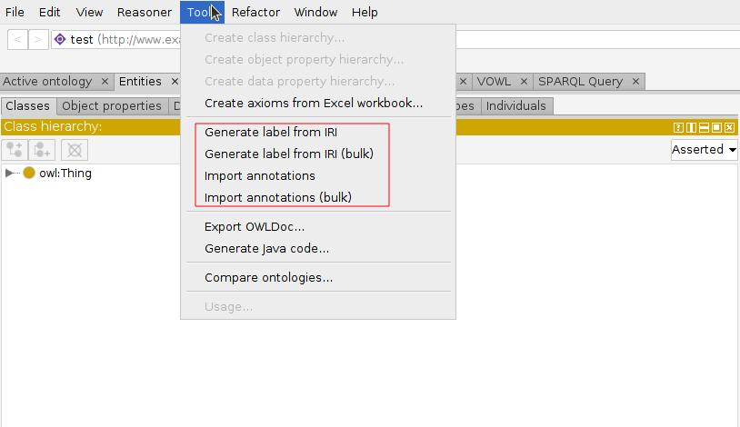
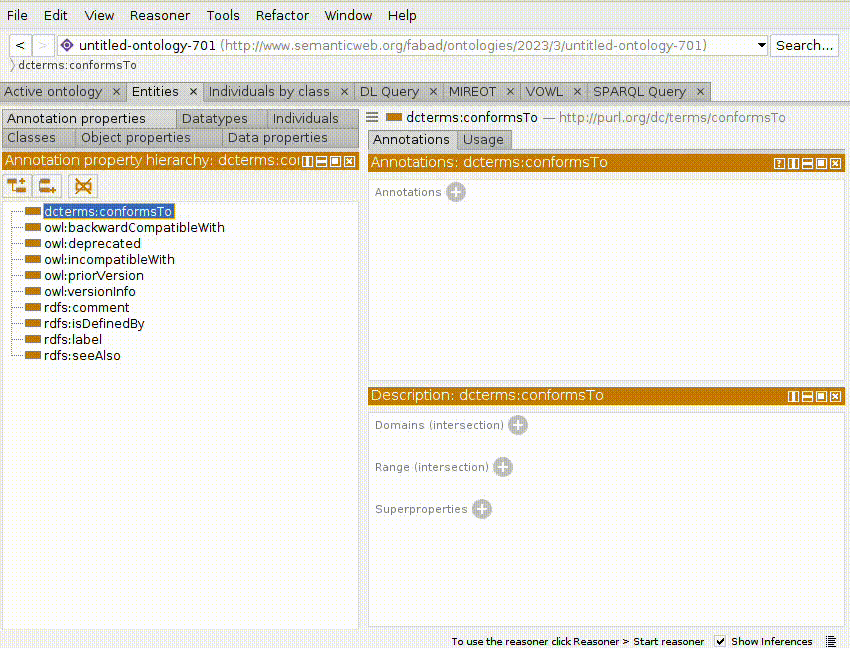
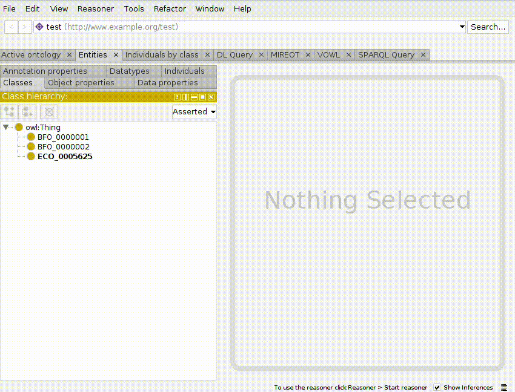

# readability-utils-protege-plugin
Protege plugin that includes functionality to improve the readability of ontologies

## Functionality
The functionality of this plugin is available under the *tools* section in the toolbar:

### Generate label from IRI

This action generates an rdf:label for the selected entity, based on its IRI. This is usefull when the IRI of your entity is not opaque (e.g. http://xmlns.com/foaf/0.1/Person or http://purl.org/dc/terms/conformsTo). The last part of the IRI is transformed into a label by parsing camel case and underscore notation, so the previous examples would derive in the labels '*person*' and '*conforms to*':

There is also available a bulk version of this tool, which generates a label for each entity lacking a label in the ontology.

### Import annotations

This action tries to retrieve annotations assertion axioms for the selected entity by accessing its IRI. This will only work if the IRIs of your entities can be resolved to a webpage able to return RDF statements (e.g. RDF/XML). The new annotations assertion axioms found are included in the corresponding entity. If the new annotations assertion axioms uses a new annotation property that was not initially in the ontology, its annotations are included as well.

A bulk version of this tool is available to enrich all the entities of the ontology; however, this can be a time-consuming task.

## Install
In order to use the plugin from the last release, you can copy the jar file located [here](https://github.com/fanavarro/readability-utils-protege-plugin/releases/download/v1.0.0/readability-utils-protege-plugin-1.0.0.jar) into the plugin folder of your protege installation. After this, start protege and the functionality of the plugin should be visible under the *tool* section in the toolbar.

## Build
If you want to use a jar file compiled from the source code, follow the next steps (you will need Git, Java and Maven):

1. Get a copy of the code:

        git clone https://github.com/fanavarro/readability-utils-protege-plugin.git

2. Change into the readability-utils-protege-plugin directory.

3. Type mvn clean package.  On build completion, the "target" directory will contain a readability-utils-protege-plugin-${version}.jar file.

4. Copy the JAR file from the target directory to the "plugins" subdirectory of your Protege distribution.